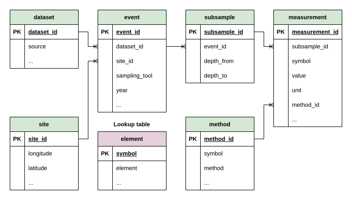

```{css, echo=FALSE}
th { white-space: nowrap; }
```

The slim schema is a **common** seven-table schema shared by all five sources.
The core structure (table set, primary/foreign keys, and the columns needed for
the trace-element analysis) is identical everywhere. Around that core, each
source keeps a handful of **source-specific** columns that carry information only
that source provides (extra identifiers, detection flags, reporting basis, and so
on).

This page shows the entity-relationship diagram and, for every table, a
per-source column comparison. A filled dot (**●**) means the column is present in
that source's slim database.

## Schema diagram

The hierarchy flows from `dataset` and `site` through `event` and `subsample`
down to `measurement`. The `element` table is a lookup for both `method` and
`measurement` via the `symbol` key.



::: {.callout-note}
The `symbol` column in `measurement` is an intentional denormalisation: it is
derivable via `method_id → method.symbol` but retained as a key for query
efficiency.
:::

```{r}
#| label: setup
library(tibble)
library(dplyr)
library(knitr)

# Render a per-source column table: logical source columns -> ● / blank.
show_table <- function(df) {
  df |>
    mutate(across(c(mar, van, ice, mud, dem), ~ ifelse(.x, "●", ""))) |>
    rename(Mareano = mar, `Vannmiljø` = van, `ICES-DOME` = ice,
           MUDAB = mud, `4Demon` = dem) |>
    kable(align = c("l", "l", "c", "c", "c", "c", "c", "c", "l"))
}
```

## `element`

Lookup table mapping chemical symbols to element names.

```{r}
tribble(
  ~Column,   ~Type,  ~Key,  ~mar, ~van, ~ice, ~mud, ~dem, ~Description,
  "symbol",  "TEXT", "PK",   TRUE, TRUE, TRUE, TRUE, TRUE, "Chemical symbol (e.g., CO, CU); FK target for method and measurement.",
  "element", "TEXT", "",     TRUE, TRUE, TRUE, TRUE, TRUE, "Full element name (e.g., Cobalt, Copper).",
  "cas_no",  "TEXT", "",     FALSE, TRUE, FALSE, TRUE, FALSE, "CAS registry number."
) |> show_table()
```

## `dataset`

A data-collection campaign or source contribution.

```{r}
tribble(
  ~Column,          ~Type,     ~Key, ~mar,  ~van,  ~ice,  ~mud,  ~dem,  ~Description,
  "dataset_id",     "INTEGER", "PK", TRUE,  TRUE,  TRUE,  TRUE,  TRUE,  "Unique dataset identifier.",
  "source",         "TEXT",    "",   TRUE,  TRUE,  TRUE,  TRUE,  TRUE,  "Source database name (e.g., Mareano).",
  "dataset_name",   "TEXT",    "",   TRUE,  TRUE,  TRUE,  TRUE,  TRUE,  "Name of the data-collection campaign / dataset.",
  "country",        "TEXT",    "",   TRUE,  TRUE,  TRUE,  FALSE, TRUE,  "Country of origin.",
  "institute",      "TEXT",    "",   TRUE,  FALSE, TRUE,  TRUE,  FALSE, "Institute responsible for the data.",
  "dataset_code",   "TEXT",    "",   FALSE, TRUE,  TRUE,  FALSE, FALSE, "Source-native dataset code.",
  "dataset_group",  "TEXT",    "",   FALSE, FALSE, FALSE, TRUE,  FALSE, "Dataset grouping (MUDAB).",
  "region",         "TEXT",    "",   FALSE, FALSE, FALSE, TRUE,  FALSE, "Marine region.",
  "institute_code", "TEXT",    "",   FALSE, FALSE, FALSE, TRUE,  FALSE, "Institute code."
) |> show_table()
```

## `site`

Unique geographic locations, keyed on latitude/longitude rounded to three
decimal places.

```{r}
tribble(
  ~Column,         ~Type,     ~Key, ~mar, ~van,  ~ice,  ~mud,  ~dem,  ~Description,
  "site_id",       "INTEGER", "PK", TRUE, TRUE,  TRUE,  TRUE,  TRUE,  "Unique site identifier.",
  "latitude",      "REAL",    "",   TRUE, TRUE,  TRUE,  TRUE,  TRUE,  "Latitude in decimal degrees (rounded to 3 d.p.).",
  "longitude",     "REAL",    "",   TRUE, TRUE,  TRUE,  TRUE,  TRUE,  "Longitude in decimal degrees (rounded to 3 d.p.).",
  "country",       "TEXT",    "",   TRUE, TRUE,  TRUE,  TRUE,  TRUE,  "Nearest country.",
  "country_code",  "TEXT",    "",   TRUE, TRUE,  TRUE,  TRUE,  TRUE,  "ISO country code.",
  "dist_to_coast", "INTEGER", "",   TRUE, TRUE,  TRUE,  TRUE,  TRUE,  "Distance to nearest coastline (km).",
  "municipality",  "TEXT",    "",   TRUE, TRUE,  TRUE,  TRUE,  TRUE,  "Nearest municipality.",
  "sea_name",      "TEXT",    "",   TRUE, TRUE,  TRUE,  TRUE,  TRUE,  "Name of the sea or ocean body.",
  "depth",         "REAL",    "",   TRUE, FALSE, FALSE, FALSE, FALSE, "Water depth (m, positive downward)."
) |> show_table()
```

## `event`

A single sampling event: one deployment of a sampling tool at a site.

```{r}
tribble(
  ~Column,            ~Type,     ~Key, ~mar,  ~van,  ~ice,  ~mud,  ~dem,  ~Description,
  "event_id",         "INTEGER", "PK", TRUE,  TRUE,  TRUE,  TRUE,  TRUE,  "Unique event identifier.",
  "dataset_id",       "INTEGER", "FK", TRUE,  TRUE,  TRUE,  TRUE,  TRUE,  "→ dataset.",
  "site_id",          "INTEGER", "FK", TRUE,  TRUE,  TRUE,  TRUE,  TRUE,  "→ site.",
  "sampling_tool",    "TEXT",    "",   TRUE,  TRUE,  TRUE,  TRUE,  TRUE,  "Sampling gear code (e.g., BC, MC, GR).",
  "year",             "INTEGER", "",   TRUE,  TRUE,  TRUE,  TRUE,  TRUE,  "Year of the sampling event.",
  "date",             "TEXT",    "",   TRUE,  FALSE, TRUE,  TRUE,  TRUE,  "Date of the sampling event.",
  "datetime",         "TEXT",    "",   FALSE, TRUE,  FALSE, FALSE, FALSE, "Combined date-time (Vannmiljø).",
  "tool_description", "TEXT",    "",   FALSE, FALSE, TRUE,  FALSE, FALSE, "Human-readable gear description.",
  "time",             "TEXT",    "",   FALSE, FALSE, FALSE, TRUE,  FALSE, "Time of the sampling event."
) |> show_table()
```

## `method`

Unique combinations of analytical method, laboratory, and detection/quantification
limits per chemical symbol.

```{r}
tribble(
  ~Column,              ~Type,     ~Key, ~mar,  ~van,  ~ice,  ~mud,  ~dem,  ~Description,
  "method_id",          "INTEGER", "PK", TRUE,  TRUE,  TRUE,  TRUE,  TRUE,  "Unique method identifier.",
  "symbol",             "TEXT",    "FK", TRUE,  TRUE,  TRUE,  TRUE,  TRUE,  "→ element.",
  "method",             "TEXT",    "",   TRUE,  TRUE,  TRUE,  TRUE,  TRUE,  "Analytical method (e.g., ICP-MS, ICP-AES).",
  "lab",                "TEXT",    "",   TRUE,  FALSE, TRUE,  TRUE,  FALSE, "Laboratory that performed the analysis.",
  "lab_name",           "TEXT",    "",   FALSE, FALSE, TRUE,  TRUE,  FALSE, "Full laboratory name.",
  "lld",                "REAL",    "",   TRUE,  FALSE, FALSE, FALSE, FALSE, "Lower level of detection (Mareano).",
  "lod",                "REAL",    "",   FALSE, TRUE,  TRUE,  TRUE,  FALSE, "Limit of detection.",
  "loq",                "REAL",    "",   FALSE, TRUE,  TRUE,  TRUE,  FALSE, "Limit of quantification.",
  "uncertainty",        "REAL",    "",   FALSE, FALSE, FALSE, TRUE,  FALSE, "Reported measurement uncertainty.",
  "method_description", "TEXT",    "",   FALSE, FALSE, TRUE,  TRUE,  FALSE, "Free-text method description.",
  "comment",            "TEXT",    "",   TRUE,  FALSE, FALSE, FALSE, FALSE, "Comment on the method / LLD."
) |> show_table()
```

## `subsample`

A discrete depth interval within a sampling event. This table is **identical
across all five sources**.

```{r}
tribble(
  ~Column,        ~Type,     ~Key, ~mar, ~van, ~ice, ~mud, ~dem, ~Description,
  "subsample_id", "INTEGER", "PK", TRUE, TRUE, TRUE, TRUE, TRUE, "Unique subsample identifier.",
  "event_id",     "INTEGER", "FK", TRUE, TRUE, TRUE, TRUE, TRUE, "→ event.",
  "depth_from",   "INTEGER", "",   TRUE, TRUE, TRUE, TRUE, TRUE, "Top depth of the interval (cm).",
  "depth_to",     "INTEGER", "",   TRUE, TRUE, TRUE, TRUE, TRUE, "Bottom depth of the interval (cm)."
) |> show_table()
```

## `measurement`

Chemical concentration values per subsample and symbol. This table carries the
most source-specific variation, because each source reports its own quality
flags, reporting basis, and derived values.

```{r}
tribble(
  ~Column,                 ~Type,      ~Key, ~mar,  ~van,  ~ice,  ~mud,  ~dem,  ~Description,
  "measurement_id",        "INTEGER",  "PK", TRUE,  TRUE,  TRUE,  TRUE,  TRUE,  "Unique measurement identifier.",
  "subsample_id",          "INTEGER",  "FK", TRUE,  TRUE,  TRUE,  TRUE,  TRUE,  "→ subsample.",
  "symbol",                "TEXT",     "FK", TRUE,  TRUE,  TRUE,  TRUE,  TRUE,  "→ element (denormalised from method).",
  "value",                 "REAL",     "",   TRUE,  TRUE,  TRUE,  TRUE,  TRUE,  "Measured concentration value.",
  "unit",                  "TEXT",     "",   TRUE,  TRUE,  TRUE,  TRUE,  TRUE,  "Unit of measurement (e.g., mg/kg).",
  "method_id",             "INTEGER",  "FK", TRUE,  TRUE,  TRUE,  TRUE,  TRUE,  "→ method.",
  "below_lld",             "INTEGER",  "",   TRUE,  FALSE, FALSE, FALSE, FALSE, "1 if below the lower level of detection (Mareano).",
  "operator",              "TEXT",     "",   FALSE, TRUE,  FALSE, FALSE, FALSE, "Relational operator (<, >, =, ND).",
  "filtered",              "INTEGER",  "",   FALSE, TRUE,  FALSE, FALSE, FALSE, "1 if the sample was filtered.",
  "basis",                 "TEXT",     "",   FALSE, FALSE, TRUE,  TRUE,  TRUE,  "Reporting basis (e.g., dry / wet weight).",
  "matrix",                "TEXT",     "",   FALSE, FALSE, TRUE,  TRUE,  TRUE,  "Sample matrix / sediment fraction.",
  "qflag",                 "TEXT",     "",   FALSE, FALSE, TRUE,  TRUE,  FALSE, "ICES quality flag (<, Q, D, …).",
  "vflag",                 "TEXT/INT", "",   FALSE, FALSE, TRUE,  FALSE, TRUE,  "Value / validation flag.",
  "uncrt",                 "REAL",     "",   FALSE, FALSE, TRUE,  FALSE, FALSE, "Measurement uncertainty.",
  "metcu",                 "TEXT",     "",   FALSE, FALSE, TRUE,  FALSE, FALSE, "Uncertainty method code.",
  "dcflag",                "TEXT",     "",   FALSE, FALSE, TRUE,  FALSE, FALSE, "Detection / confirmation flag.",
  "corrected_value",       "REAL",     "",   FALSE, FALSE, FALSE, FALSE, TRUE,  "Corrected value (4Demon).",
  "fraction_range",        "TEXT",     "",   FALSE, FALSE, FALSE, FALSE, TRUE,  "Grain-size fraction range.",
  "limit_flag",            "INTEGER",  "",   FALSE, FALSE, FALSE, FALSE, TRUE,  "1 if below the limit (4Demon).",
  "range_check_flag",      "INTEGER",  "",   FALSE, FALSE, FALSE, FALSE, TRUE,  "Range-validation flag.",
  "outlier_extreme_flag",  "INTEGER",  "",   FALSE, FALSE, FALSE, FALSE, TRUE,  "Extreme-value outlier flag.",
  "outlier_stdev_flag",    "INTEGER",  "",   FALSE, FALSE, FALSE, FALSE, TRUE,  "Standard-deviation outlier flag."
) |> show_table()
```

## Quality-control & marking columns

On top of the structural schema above, the slim quality-control steps append a
common set of classification and flag columns. These are **identical across all
five sources** and never overwrite the original values; they only classify or
mark records for review or later removal. Their detailed semantics are covered on
the *Flagging* pages.

```{r}
tribble(
  ~Table,        ~Column,      ~Type,     ~Meaning,
  "element",     "category",   "TEXT",    "Measurand class: target / reference / organic / composition.",
  "site",        "area_flag",  "TEXT",    "Location flag: outside_europe, else NULL.",
  "event",       "n_layers",   "INTEGER", "Number of subsamples (depth layers) under the event.",
  "event",       "multi_flag", "INTEGER", "1 = multi-layer / -core sampling, 0 = single grab.",
  "subsample",   "fe_exist",   "INTEGER", "1 = an Fe (iron) normaliser measurement is present.",
  "subsample",   "al_exist",   "INTEGER", "1 = an Al (aluminium) normaliser measurement is present.",
  "subsample",   "org_exist",  "INTEGER", "1 = an organic-carbon measurement (CORG / TOC) is present.",
  "subsample",   "comp_exist", "INTEGER", "1 = a grain-size composition measurement is present.",
  "measurement", "invalid_flag", "TEXT",  "Value flag: negative / over_range, else NULL.",
  "measurement", "dup_flag",   "TEXT",    "duplicate / technical_replicate, else NULL.",
  "measurement", "below_loq",  "INTEGER", "1 = value is below the detection / quantification limit.",
  "measurement", "value_std",  "REAL",    "Standardised value (chemistry mg/kg, composition %), else NULL.",
  "measurement", "unit_std",   "TEXT",    "Unit of value_std: mg/kg or %, else NULL.",
  "measurement", "range_flag", "TEXT",    "Plausible-range flag: below_min / above_max, else NULL.",
  "measurement", "below_loq_num", "INTEGER", "1 = value below the method's numeric limit (chemistry only), else 0 / NULL.",
  "measurement", "weight_basis", "TEXT",     "Sample weight basis of a chemistry value: dry / wet, else NULL."
) |> kable()
```

Beyond these common columns, some sources carry **source-specific** columns from
the later steps: `measurement.src_flag` (native quality flags, on Vannmiljø /
ICES-DOME / 4Demon); `measurement.value_std_corr` / `gs_corr` (corrected grain-size
value and its marker, on ICES-DOME / MUDAB / Vannmiljø); and
`subsample.fines_lt63` / `fines_basis` (the derived <63µm grain-size fraction, on
every source with grain-size, i.e. all but 4Demon). These are documented on the
*Source Specific* and *Grain size* pages.
